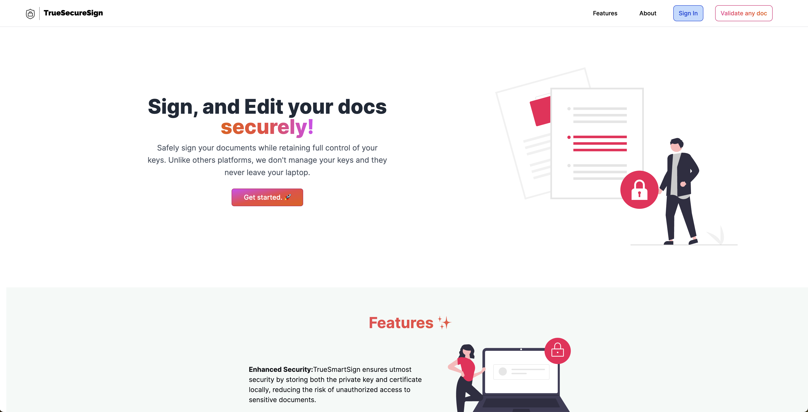

# TrueSecureSign

## Motivation

In an era where large companies store and manage our encryption keys and signing keys, there is a growing concern about the security and integrity of our digital identities. Theoretically, these companies have the capability to sign on our behalf, raising questions about data authenticity and privacy. With the increasing prevalence of identity theft, deepfakes, and other fraudulent activities, it has become crucial to employ robust tools that provide assurance to recipients that they have received authentic and trustworthy data.

**TrueSecureSign was born out of the necessity for better control over our encryption and signing keys**. Our motivation is to offer a transparent service that enables users to manage their own keys securely and ensures that these keys are never sent to any server for signing purposes. By eliminating the reliance on third-party services and storing keys locally, we empower users to have complete authority and confidence in the authenticity of their digital interactions.





## Features

* **Effortless Digital Signatures**: Sign PDFs effortlessly using TrueSmartSign's intuitive signing process, providing legally binding electronic signatures that save time and streamline document workflows.

* **Backup and Sync with 1password**: Safeguard your data with TrueSmartSign's backup feature, which securely stores a local backup of your private key and certificate using our CLI. Rest assured that your sensitive information is never sent to our servers or accessible by anyone, providing an added layer of privacy and control over your digital assets.

* **Easy PDF Editing**: Seamlessly edit PDFs with TrueSmartSign's user-friendly interface, empowering you to make quick modifications without the need for complex software.

* **Enhanced Security**: TrueSmartSign ensures utmost security by storing both the private key and certificate locally, reducing the risk of unauthorized access to sensitive documents.


## Project Structure

The TrueSecureSign project comprises two main components: the CLI app and the Next.js server.

### 1. CLI (Command-Line Interface)

The `rottweiler/` directory contains the TrueSecureSign CLI application. It is designed to provide a secure and efficient way to initialize private keys and sign PDF documents. The CLI allows users to locally generate and manage their keys, ensuring that no unauthorized entity can sign documents on their behalf. The CLI app is published on [npm](https://www.npmjs.com/package/truesecuresign) for easy installation and global usage.

To begin using our CLI, simply execute the following command:

```shell
npx truesecuresign@latest init
```
For further details, please consult our [npm page](https://www.npmjs.com/package/truesecuresign).

### 2. Server (Next.js Application)

The `coco/` directory houses the Next.js application for TrueSecureSign. This web-based application offers a user-friendly interface for managing keys, certificates, and other related functionalities. The Next.js server provides a seamless experience for users to securely interact with their keys, backup them locally to 1Password, and sign documents with confidence. The server is deployed at [https://truesecuresign.vercel.app/](https://truesecuresign.vercel.app/), providing accessibility and convenience to users.

We believe that by offering both a robust CLI and a user-friendly web server, TrueSecureSign presents a comprehensive solution for managing keys securely and ensuring the authenticity of digital data.
